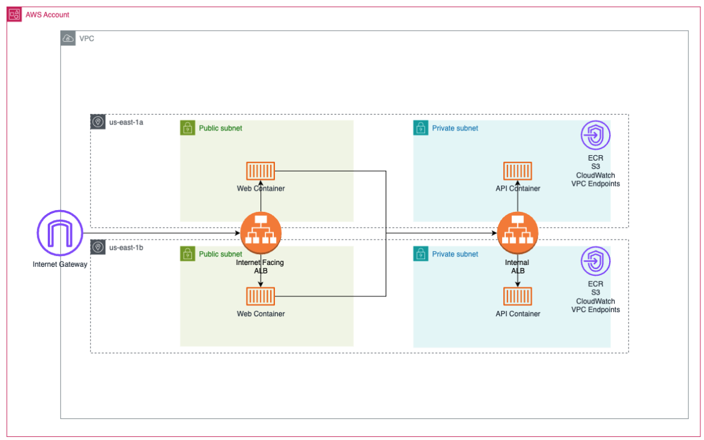

# How to Run

install node and npm on your machine: [Install NPM](https://docs.npmjs.com/downloading-and-installing-node-js-and-npm)


Install npm packages under `pulumi` directory:
```
npm install
```

Paste AWS Credentials into current bash session
```
export AWS_ACCESS_KEY_ID=xxxx
export AWS_SECRET_ACCESS_KEY=xxxxx
export AWS_SESSION_TOKEN=xxxx
export AWS_DEFAULT_REGION=us-east-1
```

Use pulumi to deploy in to `dev` stack.

```
pulumi up -s dev 
```


# Infrastructure diagram



# Default Tags for Dev Stack

```
config:
  aws:defaultTags:
    tags:
      environment: dev
      project: assessment
```